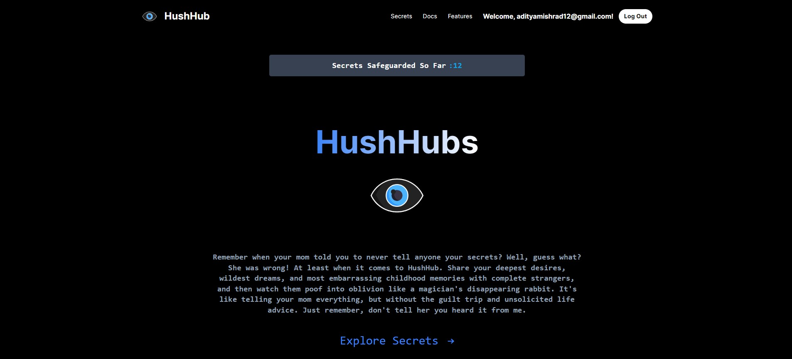
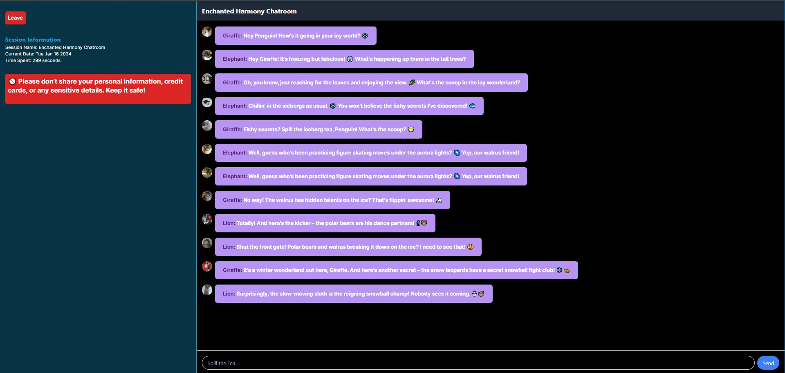

# Secret Sharing App 🤐🔒

🏠 **Home**



🗨️ **Secrets Chatroom**



This is a secret sharing app built with React.js, Auth0 for authentication, and Firebase for real-time communication and message storing.

## Installation

1. Clone the repository:

   ```bash
   git clone https://github.com/Ciriously/SecretSharingApp
   ```

2. Navigate to the project directory:

   ```bash
   cd SecretsApp
   ```

3. Install the dependencies:

   ```bash
   npm install
   ```

4. Create a Firebase project and configure it in the app:

   - Go to the [Firebase Console](https://console.firebase.google.com/) and create a new project.
   - Enable the Authentication and Realtime Database services.
   - Copy the Firebase configuration object.
   - Rename the `.env.example` file to `.env` and replace the placeholders with your Firebase configuration.

5. Set up Auth0 for authentication:

   - Go to the [Auth0 Dashboard](https://manage.auth0.com/) and create a new application.
   - Configure the allowed callback URLs and logout URLs for your app.
   - Copy the Auth0 configuration object.
   - Replace the placeholders in the `.env` file with your Auth0 configuration.

6. Start the development server:

   ```bash
   npm start
   ```

7. Open the app in your browser:

   ```
   http://localhost:3000
   ```

🌐 **Deployed Version**

The app is deployed on Vercel. You can access it [HushHub](https://secretsharingapp.vercel.app/).

## Features 🚀

- User authentication with Auth0.
- Real-time communication using Firebase Realtime Database.
- Secure message storing and sharing.
- User-friendly interface with emojis for a fun experience.

## License

This project is licensed under the [MIT License](LICENSE).
